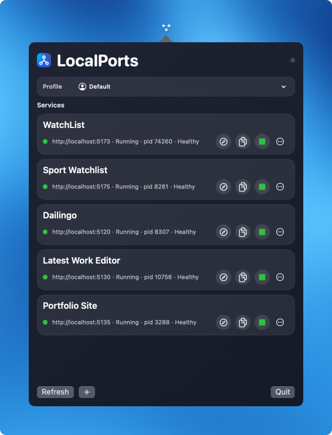

# LocalPorts

LocalPorts is a macOS menu bar app that helps you manage local services from one place.



Most people should install LocalPorts from GitHub Releases. Developer build details are kept at the end of this README.

## End User Guide (Releases)

### What's New in v1.0.3
- easier access to settings: new `Settings` (gear) button next to `Refresh` in the popover footer
- optional process details on cards (`process` + `user`) from `Settings > Browser & Display`
- browser control improvements:
  - choose a global browser for the `Open` button
  - optionally set a different browser per service in Add/Edit
- cleaner service status text for better readability, with full details available on hover tooltip

### What It Does
- shows your saved local services and their status (`Running`, `Stopped`, `Starting`, `Stopping`, `Error`)
- lets you open/copy URLs quickly
- can start, stop, restart, and force-stop services
- supports profiles so you can group services per project/context

### Download and Install
1. Open the latest release: `https://github.com/onderk-motion/LocalPorts/releases/latest`
2. Download `LocalPorts-vX.Y.Z.zip` from the **Assets** section.
3. Unzip the file.
4. Drag `LocalPorts.app` into `/Applications`.
5. Launch:

```bash
open /Applications/LocalPorts.app
```

If macOS blocks first launch, Control-click `LocalPorts.app` in Finder, choose `Open`, then confirm.

### Which Release File Should I Download?
- `LocalPorts-vX.Y.Z.zip`: the app package you should install
- `LocalPorts-vX.Y.Z.zip.sha256`: optional integrity checksum
- `Source code (zip/tar.gz)`: source snapshot only, not a runnable app

Optional checksum verification:

```bash
cd ~/Downloads
shasum -a 256 -c LocalPorts-vX.Y.Z.zip.sha256
```

### First 2 Minutes
1. Click the LocalPorts icon in the menu bar.
2. Review built-in cards and update folder/command fields if needed.
3. Add your own service with `+`.
4. Set `Address` (`http://localhost:PORT`), then optionally `Project Folder` + `Start Command`.
5. Use `Test Command` before saving.
6. Use `Refresh` to trigger an immediate port scan.

### Core Usage
- Left click menu bar icon: open/close the services popover.
- Right click (or Control-click) icon: open `Settings` and `Quit`.
- Use the footer buttons: `Refresh`, `Settings`, `+` (add service), `Quit`.
- Card actions: `Open` (browser), `Copy`, `Start`/`Stop`, `More` (rename/restart/edit/show in Finder/force stop/remove custom card).

### Common Problems

#### "Application is not supported on this Mac"
- usually caused by downloading `Source code (zip)` instead of release asset
- requires macOS `13.0+`
- use recent release assets (`v1.0.2+`) for universal Intel + Apple Silicon builds

#### Service does not start
- open diagnostics in Settings, or inspect:

```bash
tail -n 200 ~/Library/Logs/LocalPorts/*.log
```

Likely causes: invalid folder path, missing runtime (`npm`, `pnpm`, etc.), or command exits immediately.

## Features

- menu bar-first workflow (`LSUIElement` accessory app)
- profile support (create, rename, switch, delete)
- service cards with status + health checks
- optional process details in card status line (`process` + `user`)
- browser preferences:
  - global browser for `Open`
  - per-service browser override in Add/Edit
- command presets (`npm run dev`, `pnpm dev`, `yarn dev`, `node server.js`)
- startup options: `Start LocalPorts app on login`, `Launch in the background`
- config export/import with safety checks
- imported commands require explicit trust before start
- start failure diagnostics with secret redaction

## Requirements

- macOS `13.0+`
- for managed starts: required runtime for your command (`node`, `npm`, `pnpm`, etc.)
- `lsof` at `/usr/sbin/lsof` (default on macOS)

## Data, Config, and Logs

- main config file: `~/Library/Application Support/com.localports.app/config.v1.json`
- automatic backup: `~/Library/Application Support/com.localports.app/config.v1.json.bak`
- diagnostics logs: `~/Library/Logs/LocalPorts/<service-id>.log`

Config import/export is available from Settings (`Configuration Backup`).

## Developer Guide

### Local Build (Xcode)
1. Open `LocalPorts.xcodeproj`.
2. Select scheme `LocalPorts`.
3. Build and run.

### Local Build (CLI)

```bash
cd "<repo-root>"
xcodebuild -project LocalPorts.xcodeproj -scheme LocalPorts -configuration Debug build
```

### Release Build (Unsigned)

```bash
cd "<repo-root>"
xcodebuild -project LocalPorts.xcodeproj \
  -scheme LocalPorts \
  -configuration Release \
  -destination "generic/platform=macOS" \
  CODE_SIGNING_ALLOWED=NO \
  CODE_SIGNING_REQUIRED=NO \
  build
```

### CI and Release Automation
- CI workflow: `.github/workflows/ci.yml`
- local CI-equivalent smoke command:

```bash
./scripts/ci-smoke.sh
```

- release workflow: `.github/workflows/release.yml`
- release assets are created on tag push (`v*`) as `LocalPorts-vX.Y.Z.zip` and `LocalPorts-vX.Y.Z.zip.sha256`

## Project Structure

```text
App/
  AppDelegate.swift
  LocalPortsApp.swift
  StatusBarController.swift
  Models/
  Services/
  ViewModels/
  Views/
  Assets.xcassets/
  Info.plist

LocalPorts.xcodeproj/
scripts/
README.md
```

## Security and Distribution Notes

- imported config files are sanitized before save
- imported start commands are locked until user trust confirmation
- logs redact common token/secret patterns
- for public distribution without warnings: sign with Developer ID and notarize via Apple

## Open Source Collaboration

- `LICENSE`
- `CONTRIBUTING.md`
- `CODE_OF_CONDUCT.md`
- `SECURITY.md`
