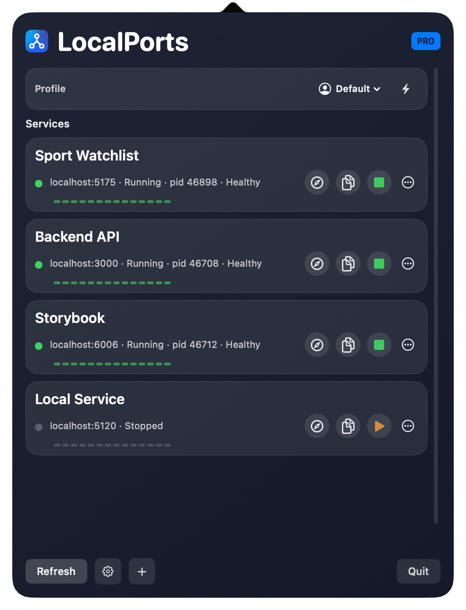
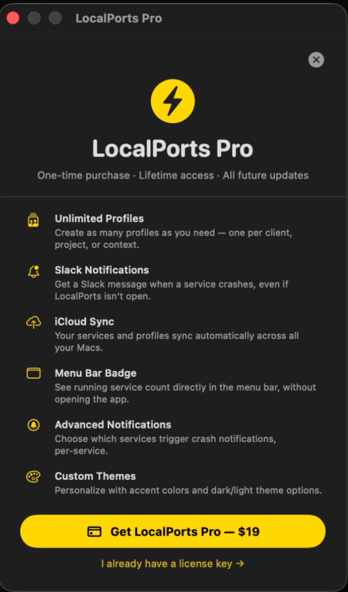
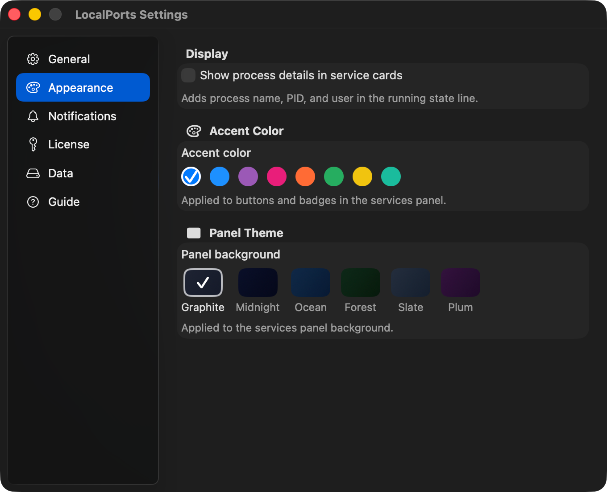

# LocalPorts

LocalPorts is a macOS menu bar app that helps you manage local development services from one place.



## Download

**[→ Latest Release](https://github.com/onderk-motion/LocalPorts/releases/latest)**

Download `LocalPorts-2.0.2.dmg`, open it, and drag LocalPorts to `/Applications`. The app is notarized — no additional steps needed.

Requires macOS 13.0+.

## Free vs Pro

| Feature | Free | Pro |
|---------|------|-----|
| Managed services (start/stop) | ✓ | ✓ |
| Port monitoring | ✓ | ✓ |
| Profiles | Up to 3 | Unlimited |
| Service log viewer | ✓ | ✓ |
| Auto-restart on crash | — | ✓ |
| Service categories | — | ✓ |
| Health history | — | ✓ |
| Advanced notifications | — | ✓ |
| Webhook notifications | — | ✓ |
| iCloud Sync | — | ✓ |
| Export / Import profiles | — | ✓ |

**[Upgrade to Pro — $19 lifetime](https://onderk.lemonsqueezy.com/checkout/buy/3f384d3a-2bfb-4b4c-b5e8-c81bdbb21bd8)**

  

## Quick Start

1. Click the LocalPorts icon in the menu bar.
2. Add a service with `+` — enter a name, address (`http://localhost:PORT`), and optionally a start command.
3. Use `Start` to launch the service, `Open` to open it in your browser.

## Core Usage

- **Left-click** the menu bar icon to open/close the services panel.
- **Right-click** the icon to access Settings and Quit.
- **Footer buttons**: Refresh, Settings, Add service (`+`), Quit.
- **Card actions**: Open in browser, Copy URL, Start/Stop, View logs, Edit, Remove.

## What's New in v2.0.2

- **Fast-fail logs** — services that exit immediately now surface their last stdout/stderr lines in the log panel instead of showing an empty view
- **Advanced settings** — added a dedicated tab for technical options that should stay off the happy path for most users
- **Refresh mode control** — choose between `Balanced`, `Low Resource`, and `Realtime` refresh behavior depending on CPU sensitivity
- **Shell environment option** — optionally inherit the user's login shell environment for `nvm`, `asdf`, `fnm`, `mise`, and similar setups
- **Experimental TCP services** — optionally allow non-HTTP localhost services such as database ports without changing the default web-focused flow

## What's New in v2.0.1

- **Config persistence fix** — startup no longer falls back to a blank default config after a restart
- **Cleaner local storage** — config files now live under `~/Library/Application Support/LocalPorts/`
- **Background launch fix** — Start on Login now stays hidden in the menu bar instead of opening the UI on boot
- **Cleaner header** — removed the build number badge from the main popover

## What's New in v2.0.0

- **Managed services** — start, stop, restart, and force-stop services directly from the menu bar
- **Service log viewer** — stream stdout/stderr output in a live log panel
- **Auto-restart** — automatically restart a service if it stops unexpectedly *(Pro)*
- **Service categories** — group services with custom labels *(Pro)*
- **Health history** — persistent status history bar per service *(Pro)*
- **Advanced notifications** — per-service crash notification toggle *(Pro)*
- **Webhook notifications** — send alerts to Slack, Discord, Teams, or custom URLs *(Pro)*
- **iCloud Sync** — sync your config across Macs *(Pro)*
- **Export / Import profiles** — back up and restore service configurations *(Pro)*
- **Sparkle auto-updates** — get notified of new releases in-app
- **Port conflict detection** — inline warning when a port is already in use
- **Multiple profiles** — group services per project or context

## Common Issues

### Service does not start
Check that the working directory and start command are correct. View the live log from the card's log button, or inspect:

```bash
tail -n 200 ~/Library/Logs/LocalPorts/*.log
```

### App is blocked by macOS
Since v2.0.0 LocalPorts is notarized. If you're on an older build, right-click the app in Finder, choose **Open**, then confirm.

## Data and Config

| Path | Purpose |
|------|---------|
| `~/Library/Application Support/LocalPorts/config.v1.json` | Main config |
| `~/Library/Application Support/LocalPorts/history.v1.json` | Health history |
| `~/Library/Logs/LocalPorts/<service-id>.log` | Service logs |

With iCloud Sync enabled (Pro), the config moves to `~/Library/Mobile Documents/iCloud~com~localports~app/Documents/config.v1.json`.

## Developer Guide

### Requirements

- macOS 13.0+
- Xcode 15+

### Local Build

```bash
xcodebuild -project LocalPorts.xcodeproj -scheme LocalPorts -configuration Debug \
  -allowProvisioningUpdates build
```

### Project Structure

```
App/
  AppDelegate.swift
  LocalPortsApp.swift
  StatusBarController.swift
  Models/
  Services/
  ViewModels/
  Views/
LocalPorts.xcodeproj/
docs/
  appcast.xml
```

Pro-only source lives in a private repository and is excluded from this repo via `.gitignore`.

## Open Source

- [LICENSE](LICENSE)
- [CONTRIBUTING.md](CONTRIBUTING.md)
- [CODE_OF_CONDUCT.md](CODE_OF_CONDUCT.md)
- [SECURITY.md](SECURITY.md)
